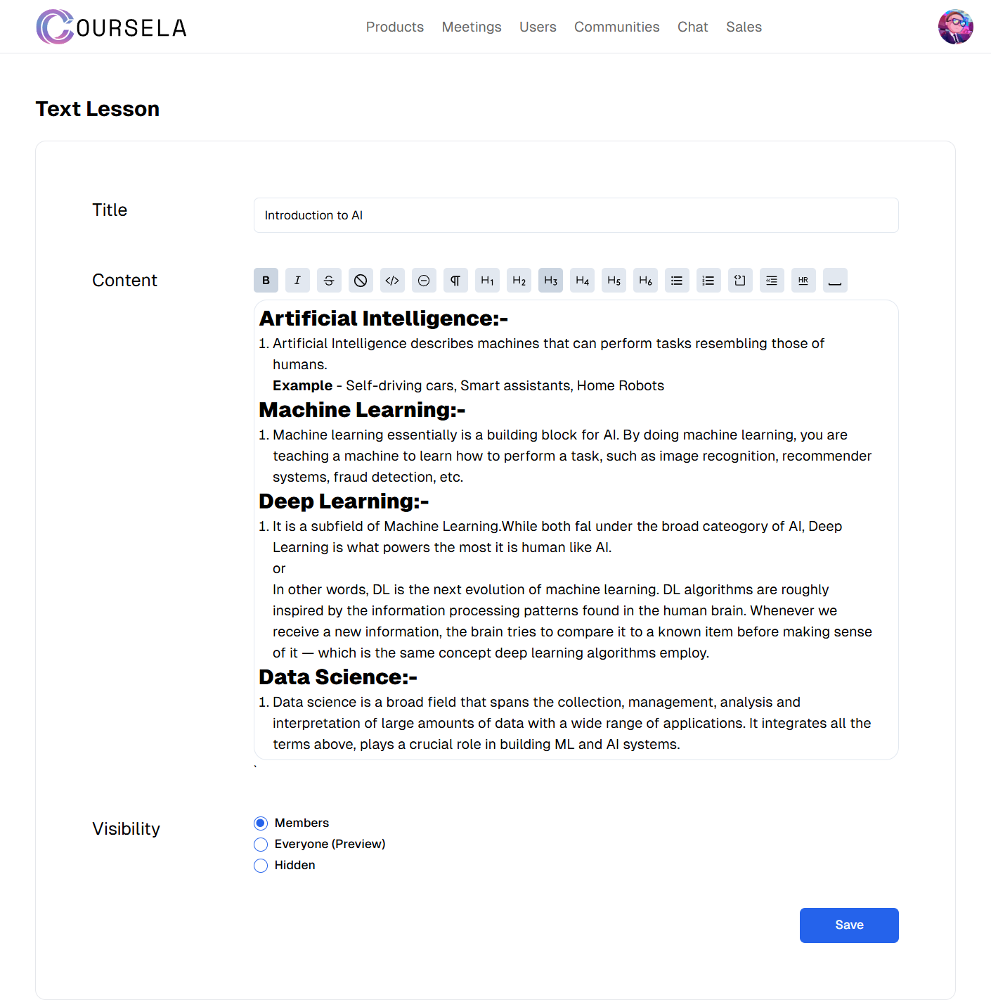
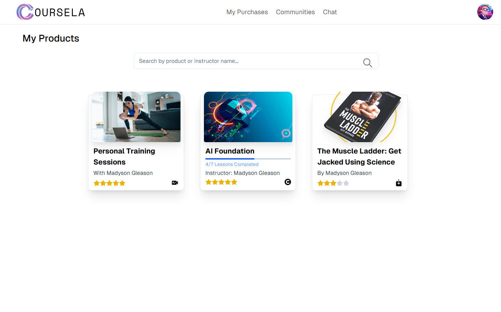

# Coursela - Monetize Your Expertise Through Digital Products

**Coursela** is an innovative platform designed for teachers, content creators, and experts to monetize their knowledge and skills. With tools for creating and selling digital products like online courses, eBooks, and live coaching sessions, Coursela bridges the gap between expertise and income generation. Here's a detailed preview of its features and functionalities.

---
## 🛠️ Technology Stack

This project leverages a modern tech stack to deliver a scalable, secure, and performant platform:

- **ASP.NET with C#**: Powers the backend with robust business logic, security, and scalability, ideal for complex applications.  
- **SQL Server**: Handles data management with support for complex queries and seamless integration with the backend.  
- **React with Next.js**: Combines dynamic user interfaces (React) with server-side rendering (Next.js) for improved performance and SEO.  
- **Tailwind CSS**: A utility-first framework for creating responsive, modern, and consistent designs.  
- **TypeScript**: Adds type safety and reduces runtime errors for maintainable and reliable frontend and backend code.  
- **WebSocket & SignalR**: Enables real-time communication for features like live chat and updates, enhancing user engagement.

### Why This Stack?
This stack was chosen for its ability to build a secure, responsive, and interactive platform that can scale with user demands while maintaining high performance.

---

## 🖼️ Visual Preview

### 1. **Landing Page**

- The homepage greets users with an inviting design, showcasing featured courses and key features of the platform. Users can quickly register, log in, or explore offerings.

---

### 2. **User Registration**
#### Role Selection

- During registration, users choose their role—Admin (content creator) or User (learner). This ensures a tailored experience based on their needs.

#### Registration Form

- A clean and intuitive form captures user information for seamless onboarding.

---

### 3. **Admin Panel**

#### Product Creation

- Admins can create digital products, including:
  - **Courses** with lessons grouped into sections.
  - **Digital Downloads** like eBooks or project files.
  - **Live Coaching Sessions** for one-on-one interaction.

#### Lesson Management
##### Text Lesson

- Use a text editor to craft rich, detailed lessons.

##### Video Lesson

- Upload videos and provide accompanying descriptions for visual learning.

##### Quiz Lesson

- Add quizzes with multiple-choice or subjective questions, setting scores and feedback criteria.

---

### 4. **User Experience**
#### User Dashboard

- Users can view purchased products, track progress, and access course materials.

#### Lesson Views
- **Text Lesson**
  
  - Simple and engaging text-based content.
- **Video Lesson**
  
  - Stream video lessons directly from the platform.
- **Quiz Interaction**
  
  - Attempt quizzes and receive instant feedback.

#### Community Engagement

- Product-specific communities allow users to interact, collaborate, and exchange ideas.

---

### 5. **Guest Access**
#### Product Previews

- Guests can explore available products and preview their content, including course details, pricing, and reviews.

#### Coaching Availability

- View coaching session descriptions, schedules, and instructor details before booking.

---

### 6. **Chat Feature**

- A built-in chat system connects users with admins or instructors for real-time support and interaction.

---

## 🔍 Key Features

- **Course Creation:** Design courses with flexible lesson formats.
- **Sales Dashboard:** Monitor product sales, revenue, and performance.
- **Interactive Quizzes:** Add MCQs and subjective questions to engage users.
- **Community Spaces:** Foster collaboration and learning with dedicated product communities.
- **Integrated Chat:** Seamless communication between users and admins.
- **Multi-format Support:** Lessons can include text, images, videos, PDFs, and more.

---
